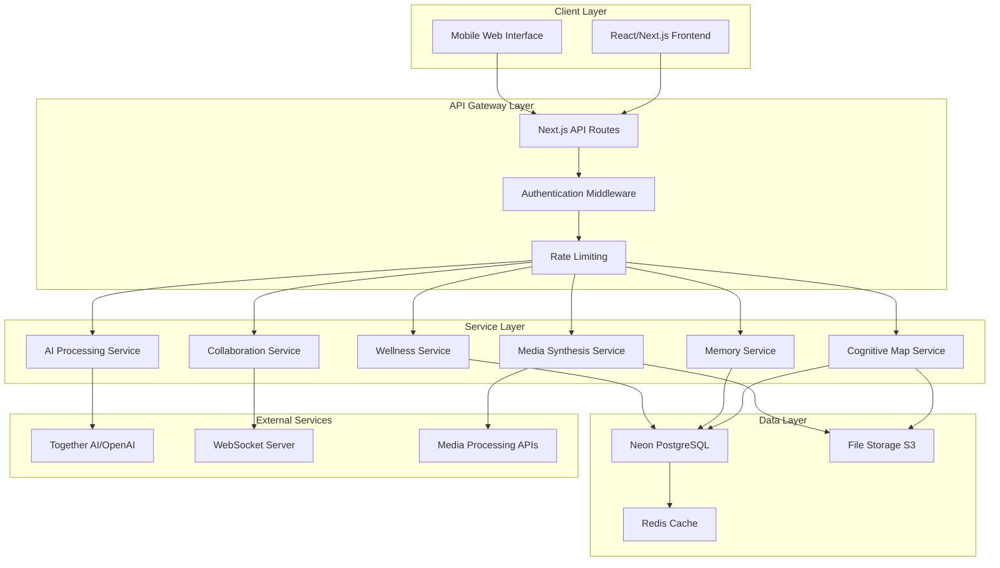

# Design Document

## Overview

MindMesh is architected as a modern, scalable web application built on Next.js with TypeScript, designed to provide an intelligent knowledge companion experience. The platform employs a modular, microservices-inspired architecture that separates concerns across cognitive mapping, AI processing, collaboration, and wellness features. The design emphasizes real-time interactions, AI integration, and extensibility while maintaining performance and security standards.

The system architecture follows a layered approach with a React-based frontend, Next.js API routes for backend services, PostgreSQL for data persistence, and external AI services for natural language processing. The design supports both individual and collaborative workflows through real-time synchronization and role-based access controls.

## Architecture

### High-Level Architecture



### Technology Stack

- **Frontend**: Next.js 14+ with TypeScript, Tailwind CSS, React Query for state management
- **Backend**: Next.js API routes, Node.js runtime
- **Database**: Neon (serverless PostgreSQL) with Prisma ORM
- **AI Integration**: Together AI or OpenAI API with custom prompt engineering
- **Real-time**: WebSockets via Socket.io for collaborative features
- **Authentication**: Clerk or Auth0 for secure user management
- **File Storage**: AWS S3 or Vercel Blob for document and media storage
- **Caching**: Redis for session management and performance optimization
- **Deployment**: Vercel or AWS with CDN for global distribution

## Components and Interfaces

### Core Components

#### 1. Cognitive Map Engine
**Purpose**: Manages interactive mind mapping functionality with node relationships

**Key Interfaces**:
```typescript
interface CognitiveNode {
  id: string;
  type: 'article' | 'flashcard' | 'multimedia' | 'concept' | 'project';
  title: string;
  content: string;
  position: { x: number; y: number };
  metadata: Record<string, any>;
  createdAt: Date;
  updatedAt: Date;
}

interface NodeConnection {
  id: string;
  sourceNodeId: string;
  targetNodeId: string;
  relationshipType: string;
  label?: string;
  strength: number;
}

interface CognitiveMap {
  id: string;
  userId: string;
  title: string;
  nodes: CognitiveNode[];
  connections: NodeConnection[];
  isPublic: boolean;
  collaborators: string[];
}
```

#### 2. AI Processing Engine
**Purpose**: Handles dual-mode AI interactions with context awareness

**Key Interfaces**:
```typescript
interface AIContext {
  userId: string;
  mode: 'scholar' | 'explorer';
  uploadedDocuments: Document[];
  conversationHistory: Message[];
  currentProject?: string;
}

interface AIResponse {
  content: string;
  citations?: Citation[];
  confidence: number;
  suggestedActions?: string[];
  relatedConcepts?: string[];
}

interface Document {
  id: string;
  title: string;
  content: string;
  type: 'pdf' | 'text' | 'web' | 'note';
  embeddings: number[];
  metadata: DocumentMetadata;
}
```

#### 3. Memory Augmentation System
**Purpose**: Implements spaced repetition and memory card management

**Key Interfaces**:
```typescript
interface MemoryCard {
  id: string;
  userId: string;
  front: string;
  back: string;
  difficulty: number;
  nextReview: Date;
  reviewCount: number;
  successRate: number;
  tags: string[];
}

interface SpacedRepetitionScheduler {
  calculateNextReview(card: MemoryCard, performance: number): Date;
  getDueCards(userId: string): Promise<MemoryCard[]>;
  updateCardPerformance(cardId: string, performance: number): Promise<void>;
}
```

#### 4. Collaboration Engine
**Purpose**: Manages real-time collaborative editing and project sharing

**Key Interfaces**:
```typescript
interface CollaborativeProject {
  id: string;
  title: string;
  description: string;
  ownerId: string;
  collaborators: Collaborator[];
  documents: SharedDocument[];
  discussions: Discussion[];
  version: number;
}

interface SharedDocument {
  id: string;
  projectId: string;
  content: string;
  version: number;
  lastModified: Date;
  lockStatus: DocumentLock;
}

interface RealTimeUpdate {
  type: 'text_change' | 'cursor_move' | 'user_join' | 'user_leave';
  userId: string;
  data: any;
  timestamp: Date;
}
```

#### 5. Media Synthesis Engine
**Purpose**: Converts content into various media formats using AI

**Key Interfaces**:
```typescript
interface MediaSynthesisRequest {
  sourceContent: string;
  outputFormat: 'infographic' | 'podcast' | 'video' | 'audio';
  style?: string;
  language?: string;
  customizations?: Record<string, any>;
}

interface GeneratedMedia {
  id: string;
  type: string;
  url: string;
  metadata: MediaMetadata;
  processingStatus: 'pending' | 'processing' | 'completed' | 'failed';
}
```

### Database Schema Design

#### Core Tables
```sql
-- Users and Authentication
CREATE TABLE users (
  id UUID PRIMARY KEY DEFAULT gen_random_uuid(),
  email VARCHAR(255) UNIQUE NOT NULL,
  name VARCHAR(255) NOT NULL,
  avatar_url TEXT,
  preferences JSONB DEFAULT '{}',
  created_at TIMESTAMP DEFAULT NOW(),
  updated_at TIMESTAMP DEFAULT NOW()
);

-- Cognitive Maps
CREATE TABLE cognitive_maps (
  id UUID PRIMARY KEY DEFAULT gen_random_uuid(),
  user_id UUID REFERENCES users(id) ON DELETE CASCADE,
  title VARCHAR(255) NOT NULL,
  description TEXT,
  is_public BOOLEAN DEFAULT FALSE,
  created_at TIMESTAMP DEFAULT NOW(),
  updated_at TIMESTAMP DEFAULT NOW()
);

-- Cognitive Nodes
CREATE TABLE cognitive_nodes (
  id UUID PRIMARY KEY DEFAULT gen_random_uuid(),
  map_id UUID REFERENCES cognitive_maps(id) ON DELETE CASCADE,
  type VARCHAR(50) NOT NULL,
  title VARCHAR(255) NOT NULL,
  content TEXT,
  position_x FLOAT NOT NULL,
  position_y FLOAT NOT NULL,
  metadata JSONB DEFAULT '{}',
  created_at TIMESTAMP DEFAULT NOW(),
  updated_at TIMESTAMP DEFAULT NOW()
);

-- Node Connections
CREATE TABLE node_connections (
  id UUID PRIMARY KEY DEFAULT gen_random_uuid(),
  source_node_id UUID REFERENCES cognitive_nodes(id) ON DELETE CASCADE,
  target_node_id UUID REFERENCES cognitive_nodes(id) ON DELETE CASCADE,
  relationship_type VARCHAR(100),
  label VARCHAR(255),
  strength FLOAT DEFAULT 1.0,
  created_at TIMESTAMP DEFAULT NOW()
);

-- Documents
CREATE TABLE documents (
  id UUID PRIMARY KEY DEFAULT gen_random_uuid(),
  user_id UUID REFERENCES users(id) ON DELETE CASCADE,
  title VARCHAR(255) NOT NULL,
  content TEXT NOT NULL,
  type VARCHAR(50) NOT NULL,
  file_url TEXT,
  embeddings VECTOR(1536), -- For AI similarity search
  metadata JSONB DEFAULT '{}',
  created_at TIMESTAMP DEFAULT NOW(),
  updated_at TIMESTAMP DEFAULT NOW()
);

-- Memory Cards
CREATE TABLE memory_cards (
  id UUID PRIMARY KEY DEFAULT gen_random_uuid(),
  user_id UUID REFERENCES users(id) ON DELETE CASCADE,
  front TEXT NOT NULL,
  back TEXT NOT NULL,
  difficulty INTEGER DEFAULT 1,
  next_review TIMESTAMP NOT NULL,
  review_count INTEGER DEFAULT 0,
  success_rate FLOAT DEFAULT 0.0,
  tags TEXT[] DEFAULT '{}',
  created_at TIMESTAMP DEFAULT NOW(),
  updated_at TIMESTAMP DEFAULT NOW()
);

-- Collaborative Projects
CREATE TABLE collaborative_projects (
  id UUID PRIMARY KEY DEFAULT gen_random_uuid(),
  title VARCHAR(255) NOT NULL,
  description TEXT,
  owner_id UUID REFERENCES users(id) ON DELETE CASCADE,
  is_public BOOLEAN DEFAULT FALSE,
  created_at TIMESTAMP DEFAULT NOW(),
  updated_at TIMESTAMP DEFAULT NOW()
);

-- Project Collaborators
CREATE TABLE project_collaborators (
  id UUID PRIMARY KEY DEFAULT gen_random_uuid(),
  project_id UUID REFERENCES collaborative_projects(id) ON DELETE CASCADE,
  user_id UUID REFERENCES users(id) ON DELETE CASCADE,
  role VARCHAR(50) DEFAULT 'collaborator',
  permissions JSONB DEFAULT '{}',
  joined_at TIMESTAMP DEFAULT NOW(),
  UNIQUE(project_id, user_id)
);
```

## Data Models

### User Profile and Preferences
The user model extends beyond basic authentication to include learning preferences, AI interaction history, and wellness tracking data. User preferences control AI behavior, notification settings, and interface customizations.

### Knowledge Graph Structure
The cognitive map system uses a graph-based data model where nodes represent knowledge entities and edges represent relationships. This structure supports complex queries for finding related concepts and enables AI-powered knowledge discovery.

### AI Context Management
AI interactions maintain context through conversation history, document embeddings, and user behavior patterns. The system uses vector embeddings for semantic search and maintains separate contexts for Scholar and Explorer modes.

### Collaboration Data Model
Collaborative features use operational transformation principles for conflict resolution in real-time editing. Version control maintains document history while supporting branching and merging workflows.

## Error Handling

### Client-Side Error Handling
- **Network Errors**: Implement retry mechanisms with exponential backoff
- **AI Service Failures**: Graceful degradation with cached responses or alternative suggestions
- **Real-time Connection Issues**: Automatic reconnection with state synchronization
- **File Upload Errors**: Progress tracking with resume capability for large files

### Server-Side Error Handling
- **Database Connection Failures**: Connection pooling with failover mechanisms
- **AI API Rate Limits**: Queue management with priority-based processing
- **Authentication Errors**: Secure error messages without information leakage
- **Resource Exhaustion**: Load balancing and auto-scaling triggers

### Error Recovery Strategies
```typescript
interface ErrorRecoveryStrategy {
  errorType: string;
  retryAttempts: number;
  backoffStrategy: 'linear' | 'exponential';
  fallbackAction?: () => Promise<void>;
  userNotification?: string;
}

const errorStrategies: ErrorRecoveryStrategy[] = [
  {
    errorType: 'AI_SERVICE_TIMEOUT',
    retryAttempts: 3,
    backoffStrategy: 'exponential',
    fallbackAction: () => provideCachedResponse(),
    userNotification: 'AI service temporarily unavailable, showing cached results'
  },
  {
    errorType: 'WEBSOCKET_DISCONNECT',
    retryAttempts: 5,
    backoffStrategy: 'exponential',
    fallbackAction: () => enableOfflineMode(),
    userNotification: 'Connection lost, working in offline mode'
  }
];
```

## Testing Strategy

### Unit Testing
- **Component Testing**: React Testing Library for UI components
- **Service Testing**: Jest for business logic and API functions
- **Database Testing**: In-memory PostgreSQL for data layer testing
- **AI Integration Testing**: Mock AI responses for consistent testing

### Integration Testing
- **API Testing**: Supertest for endpoint testing with real database
- **Real-time Features**: WebSocket testing with multiple client simulation
- **File Processing**: End-to-end testing of document upload and processing
- **Authentication Flow**: Complete user journey testing

### Performance Testing
- **Load Testing**: Artillery.js for API endpoint stress testing
- **Real-time Performance**: WebSocket connection scaling tests
- **AI Response Times**: Latency testing for AI service integration
- **Database Performance**: Query optimization and indexing validation

### Security Testing
- **Authentication Testing**: JWT token validation and expiration
- **Authorization Testing**: Role-based access control verification
- **Input Validation**: SQL injection and XSS prevention testing
- **Data Privacy**: GDPR compliance and data anonymization testing

### Testing Infrastructure
```typescript
// Example test configuration
const testConfig = {
  unit: {
    framework: 'Jest',
    coverage: {
      threshold: 80,
      excludePatterns: ['*.test.ts', 'mocks/*']
    }
  },
  integration: {
    database: 'test-postgres-instance',
    aiMocking: true,
    realTimeSimulation: true
  },
  e2e: {
    framework: 'Playwright',
    browsers: ['chromium', 'firefox', 'webkit'],
    mobileViewports: true
  }
};
```

The testing strategy ensures reliability across all platform features while maintaining development velocity through automated testing pipelines and comprehensive coverage reporting.